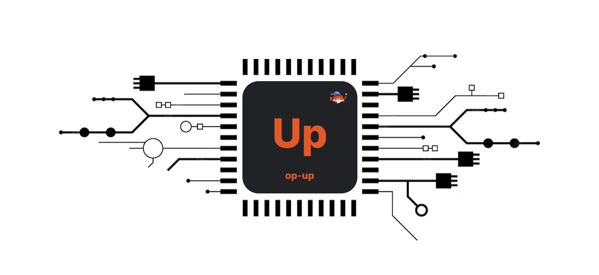

# op-up

[][gh-ci]
[][mit-license]
[![Chat][tg-badge]][tg-url]

[mit-license]: https://opensource.org/license/mit/
[gh-ci]: https://github.com/merklefruit/op-up/actions/workflows/ci.yml
[tg-url]: https://t.me/+XR8_p3qjzoFiMjEx
[tg-badge]: https://img.shields.io/badge/chat-telegram-blue

**Composable OP Stack Orchestration System**



## What is op-up?

`op-up` is the infrastructure for building composable OP Stack configurations.
Given the growing number of OP Stack component implementations, having a simple
service to spin up a composable devnet in a programmatical way is crucial for
verifying superchain compatibility, general testing and experimentation.

The project was born out of the need to test out [Magi](https://github.com/a16z/magi),
a rollup client built for the OP stack.

Have a new rollup derivation pipeline implementation for the OP Stack and want to test it?

> Use `op-up` to configure an OP Stack with the new rollup derivation pipeline.
> Then, you can spin up a local devnet and run test suites against it!

## What is the OP Stack?

The [OP Stack](https://stack.optimism.io/) is what powers the superchain!

It is a stack of various software components that, together, can be used
to fully run a chain in the superchain. The [Optimism Collective](https://app.optimism.io/announcement) has
already spent an enormous amount of effort and time building out the
[specifications](https://github.com/ethereum-optimism/optimism/blob/develop/specs/README.md)
for how [OP Stack](https://stack.optimism.io/) components work together
in an interoperable way.

For example, want to run a pure rust op-stack (almost)?

You can use
- [reth](https://github.com/paradigmxyz/reth) as an L1 execution node.
- [op-reth](https://github.com/anton-rs/op-reth/) as an L2 node (interchangeable with [op-geth](https://github.com/ethereum-optimism/op-geth)).
- [magi](https://github.com/a16z/magi) as the rollup node.

_Note, this "op-stack" does not include the "sequencer" including the
the proposer or batcher, as well as fault proof components._

// -------------- TODO: clean up below. -------------------- //

## Usage

To get started with the interactive prompt, run the following commands:

```sh
git clone git@github.com:merklefruit/op-up.git && cd op-up
make devnet
```

Once the devnet is up and running, L1 is accessible at `http://localhost:8545`, and L2 is accessible at `http://localhost:9545`.
Any Ethereum tool - Metamask, `seth`, etc. - can use these endpoints.
Note that you will need to specify the L2 chain ID manually if you use Metamask. The devnet's L2 chain ID is 901.

The devnet comes with a pre-funded account you can use as a faucet:

- Address: `0xf39fd6e51aad88f6f4ce6ab8827279cfffb92266`
- Private key: `ac0974bec39a17e36ba4a6b4d238ff944bacb478cbed5efcae784d7bf4f2ff80`

The faucet account exists on both L1 and L2.

---

To stop the devnet, run:

```sh
make devnet-stop
```

To reset the devnet state, run:

```sh
make nuke
```


## Prerequisites

You need to have [Rust](https://www.rust-lang.org/tools/install), [Docker](https://www.docker.com/), [Docker Compose](https://docs.docker.com/compose/), [Make](https://www.gnu.org/software/make/) and [jq](https://jqlang.github.io/jq/) installed on your machine to use OP-Up.

## Supported Components

- L1 Execution clients:
  - [x] [Geth (go)](https://github.com/ethereum/go-ethereum)
  - [ ] [Erigon (go)](https://github.com/ledgerwatch/erigon)
  - [ ] [Reth (rust)](https://github.com/paradigmxyz/reth)
- L2 Execution clients:
  - [x] [OP-Geth (go)](https://github.com/ethereum-optimism/optimism/tree/develop/l2geth)
  - [ ] [OP-Erigon (go)](https://github.com/testinprod-io/op-erigon)
  - [ ] [OP-Reth (rust)](https://github.com/clabby/op-reth)
- Rollup clients:
  - [x] [OP-Node (go)](https://github.com/ethereum-optimism/optimism/tree/develop/op-node)
  - [ ] [Magi (rust)](https://github.com/a16z/magi)
- Challenger agents:
  - [x] [OP-Challenger (go)](https://github.com/ethereum-optimism/optimism/tree/develop/op-challenger)
  - [ ] [OP-Challenger (rust)](https://github.com/clabby/op-challenger)


## Troubleshooting

- If you are getting some "permission denied" errors, it's likely that you need to change the Docker permissions on your machine. See [this guide](https://docs.docker.com/engine/install/linux-postinstall/) for more details.
- If you are getting the error: `Failed to install dependencies: error hardhat@2.9.6: The engine "node" is incompatible with this module.` you need to switch your NodeJS version to <=16. If you are using `nvm`, you can do so by running `nvm install 16.16.0 && nvm use 16.16.0`.
- If you are on MacOS with Apple Silicon chip and you've installed python3 via Homebrew, you might run into this error: `env: python: No such file or directory. make: *** [Release/leveldb.a] Error 127`. To fix this, you need to create a symlink to the python3 binary like so: `sudo ln -s /Library/Developer/CommandLineTools/usr/bin/python3 /usr/local/bin/python`.
- If you run into an issue while building the Hardhat bedrock project, please set your node version to `16.16.0`. For instance if you are using `nvm`, you can do so by running `nvm install 16.16.0 && nvm use 16.16.0`. See [this issue](https://github.com/ethereum-optimism/optimism#3087) for more details.

## Contributions & Bug Reports

Please report any bugs or issues you encounter by opening an issue here on GitHub. <br />
Contributions are always welcome!

## License

This project is licensed under the [MIT License](LICENSE). <br />
Free and open-source, forever.
